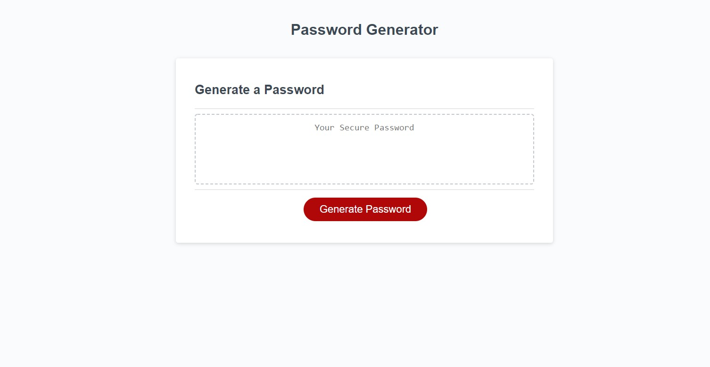
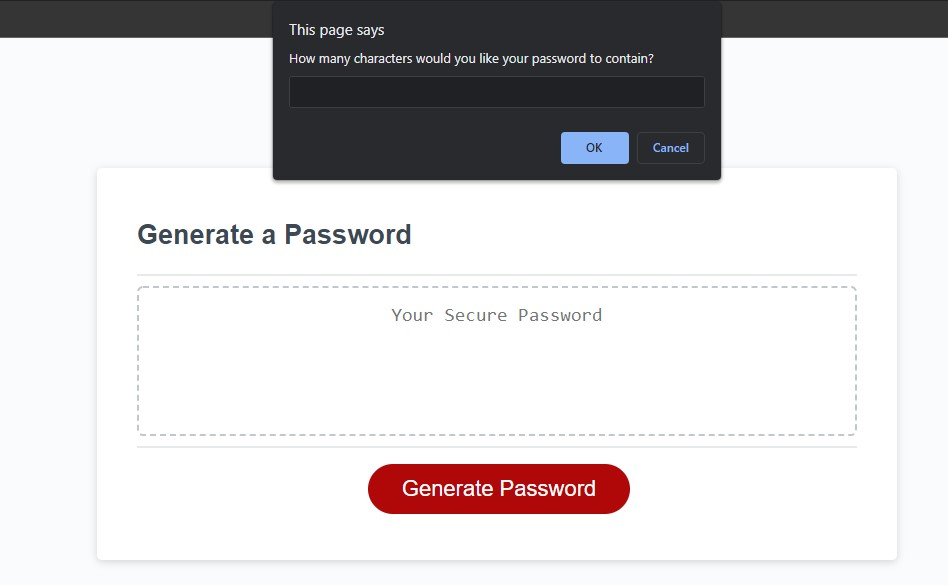
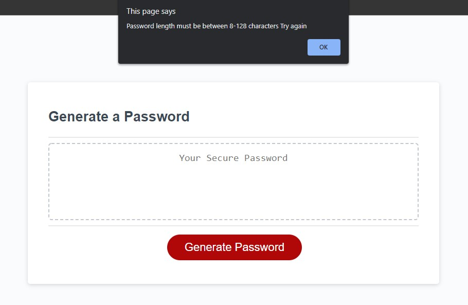
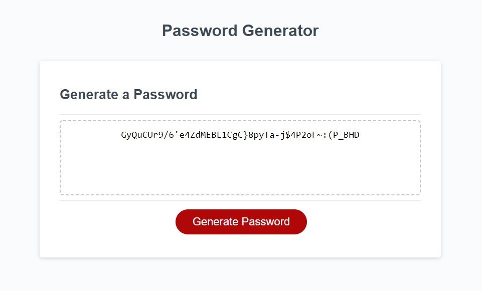

# Password Generator Starter Code

### Summary
* Password generator using Javascript.
* Prompts will show up to determine password length and characters used.

### The project layout
* When the user clicks the button to generate password, a prompt will show.
* The user will be prompted to choose the length of password between 8 and 128 characters.
* After the user inputs a number between 8-128, the user will recieve a confirm for a password containing:
    * Special characters
    * Numbers
    * Uppercase characters
    * Lowercase characters
* Once all prompts have been answered, the user will be displayed a password on the page.

* If the user does not input a number between 8-128, or put in characters, the prompt will deny the user's request and asks to try again. 
    * Using a while loop, it will continue to request until the criteria is met.
    * This will also happen if no criteria was chosen for characters used.

* After all prompts have been answered, the password will show in the box and can be highlighted and copied.

